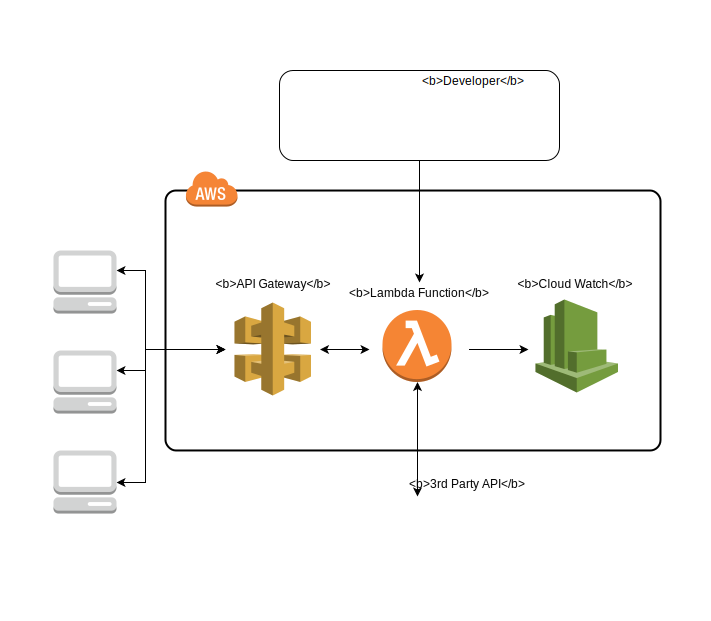

# AWS Lambda API Layer on Serverless & Node.js (using GAdventures API)

<!--  -->

## Getting Started

These instructions will get you a copy of the project up and running on your local machine for development and testing purposes. See deployment for notes on how to deploy the project on a live system.

### Prerequisites

You will need git, node, and aws-cli installed and configured with your access key

### Installing

npm install

## Deployment

serverless deploy

## Built With

- [AWS Lambda](https://aws.amazon.com/lambda/) - Run code without thinking about servers.
- [AWS API Gateway](https://aws.amazon.com/api-gateway/) - Create, maintain, and secure APIs at any scale.
- [Serverless](https://serverless.com) - Toolkit for building serverless apps.
- [Axios](https://github.com/axios/axios) - Promise based HTTP client for the browser and node.js
- [Gadventures](https://www.gadventures.com/) - Sandbox REST API, Connect to the world with small group adventure travel.
- [Draw.io](https://www.draw.io/) - Used for diagram

## Contributing

Please read [CONTRIBUTING.md](https://gist.github.com/PurpleBooth/b24679402957c63ec426) for details on our code of conduct, and the process for submitting pull requests to us.

## Versioning

We use [SemVer](http://semver.org/) for versioning. For the versions available, see the [tags on this repository](https://github.com/your/project/tags).

## Authors

- **Dani Shulman** - _Initial work_ - [PurpleBooth](https://github.com/PurpleBooth)

See also the list of [contributors](https://github.com/your/project/contributors) who participated in this project.

## License

This project is licensed under the MIT License - see the [LICENSE.md](LICENSE.md) file for details

<!-- ## Acknowledgments

- Hat tip to anyone whose code was used
- Inspiration
- etc -->
